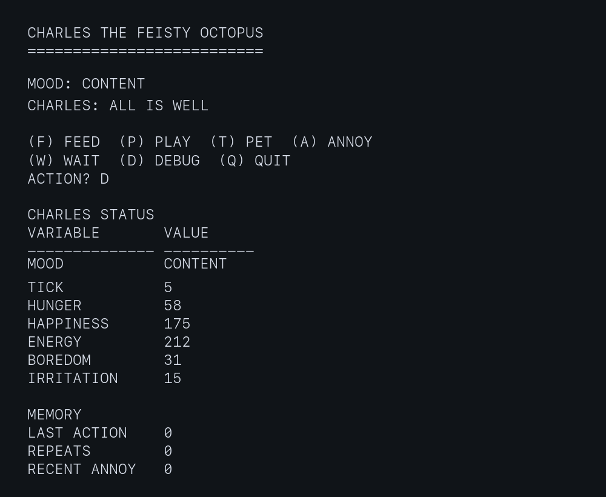

# Charles the Feisty Octopus



Charles is a small virtual octopus for the RC2014. Phases 1 to 5 provide the
complete text version, including needs, moods, opinions, keyboard interaction,
short-term memory, personality, spontaneous behaviour, and diagnostics.

## Hardware

The program requires:

- An RC2014 Mini II running BASIC
- A serial terminal for diagnostic output

No additional hardware is required for the Phase 5 text version.

## Program Files

| File               | Description                            |
| ------------------ | -------------------------------------- |
| `charles_text.bas` | Complete text implementation of Charles |
| `charles_text.png` | Example Phase 5 terminal session       |

## Running the Program

Load `charles_text.bas` into BASIC and enter `RUN`. The program runs until it
is interrupted with Ctrl-C at an action prompt.

At startup, the program displays its title, the implemented phase, and the
available controls. At each action prompt, enter one of these letters:

| Key | Action |
| --- | ------ |
| F   | Feed Charles |
| P   | Play with Charles |
| T   | Pet Charles |
| A   | Annoy Charles |
| W   | Wait without interacting |
| D   | Show a snapshot of the current internal state |
| Q   | Quit cleanly |

Uppercase and lowercase letters are accepted. Invalid input displays the valid
choices and repeats the prompt.

Charles normally displays concise mood updates, actions, and opinions. Press
`D` to print the complete internal state at that moment. The snapshot is shown
once; subsequent output remains concise. Each need value is kept in the range
0 to 255.

The timing is approximate because it uses a processor delay loop. Change `DL`
on line 30 to adjust the interval between simulation ticks, `DI` on line 40 to
adjust how often the state is printed, or `MI` on line 50 to adjust the normal
interval between Charles's messages.

## State Model

Hunger and boredom rise over time, while energy falls at a slower interval. Happiness initially settles towards a neutral value and then falls when hunger or boredom remains high. Irritation normally fades, but prolonged hunger makes it rise.

The displayed conditions use configurable thresholds near the start of the
program. Charles becomes cross when he is both very hungry and unhappy.

## Behaviour and Messages

Charles selects one of six explicit moods: content, bored, hungry, cross,
feisty, or sleepy. Feisty represents high irritation while Charles still has
enough energy to argue. Low energy ultimately makes him sleepy. A mood change
produces an immediate message; otherwise Charles speaks at the configured
message interval.

Each state has three context-sensitive messages. A pseudo-random choice varies
what Charles says, while the previous state and message number prevent an
immediate repeat within the same mood.

## Interaction

Feeding reduces hunger and usually improves happiness and energy, but Charles
refuses food when he is already full. Playing reduces boredom and improves
happiness at an energy cost, although Charles may refuse when hungry or tired.
Petting usually improves happiness and reduces irritation, but a cross Charles
objects. Annoying him reduces happiness and sharply increases irritation.

Responses use Charles's mood and needs from before the action, so the same
choice can produce a different result as his condition changes. Updated values
and mood are displayed immediately after an action.

## Memory and Personality

Charles remembers the most recent action, how many times it has been repeated,
and how many annoy actions occurred recently. Waiting or choosing a different
action breaks a repetition chain. Recent annoyance fades gradually, rather than
being forgotten immediately.

Repeated petting eventually crosses Charles's randomly chosen patience limit
and produces `STOP THAT`. Repeated play can also exhaust his patience. Annoying
him repeatedly causes progressively larger happiness and irritation changes,
with escalating responses.

At startup, narrow pseudo-random ranges determine Charles's base feistiness,
patience, appetite, and sociability. These biases affect his cross threshold,
food acceptance, tolerance for repetition, and response to petting while
keeping him recognisably Charles.

## Spontaneous Behaviour

Every 15 simulation ticks Charles experiences one pseudo-random event. He may
notice something interesting, disapprove for no stated reason, find a tiny
crab, or perform a somersault. Events make small changes to his needs.

Small pseudo-random variations also affect metabolism and the consequences of
accepted interactions. Need thresholds and mood priorities still dominate, so
randomness modifies understandable behaviour rather than replacing it.

## Debug Snapshot

The one-shot debug table shows:

- Simulation tick and current mood
- Active needs
- Hunger, happiness, energy, boredom, and irritation
- Last action number, repetition count, and recent annoyance count
- Feistiness, patience, appetite, and sociability biases

The output is divided into current state, memory, and personality sections.
Labels use a fixed-width `VARIABLE / VALUE` layout so changing numeric widths
do not disturb the table.

Action numbers are `1` feed, `2` play, `3` pet, and `4` annoy. Pressing `W`
clears the repeated-action chain but does not immediately erase recent
annoyance.

## Example Interaction

The exact values and some messages vary between runs, but a typical escalating
interaction resembles:

```text
MOOD: CONTENT
CHARLES: ACCEPTABLE.

MOOD: CONTENT
CHARLES: YES, YES.

CHARLES: STOP THAT.
MOOD: CONTENT

CHARLES: THAT WAS UNWISE.
MOOD: CROSS

CHARLES: YOU AGAIN.
MOOD: FEISTY

CHARLES: YOU ARE A FISH.
MOOD: FEISTY
```

## Configuration and Tuning

Configuration values are grouped at the beginning of the program:

- `DL` controls the approximate simulation delay.
- `DI` controls the number of ticks between action prompts.
- `MI` controls periodic messages.
- `SI` controls spontaneous events.
- `NH`, `NB`, and `NE` are the hungry, bored, and low-energy thresholds.
- `CH` and `CM` define need-driven crossness.
- `FI` is the irritation threshold for feisty behaviour.

The delay is processor-based and approximate. It may need adjustment for a
particular RC2014 clock speed. Personality-adjusted `CI` is calculated during
startup and should not be configured directly.

## Testing with cbmbasic

The text version can be tested before transfer by passing the source file to
`cbmbasic`. Its use of `MO` for mood and standard `INPUT` avoids keywords and
keyboard functions that differ between CBM BASIC and RC2014 Microsoft BASIC.

## Hardware Guidance

This version uses only a serial terminal and does not access any hardware I/O
ports. The later LCD version will require the RC2014 LCD Driver Module on ports
218 and 219. Digital I/O controls are deferred to the final hardware-input
phase and are not required by `charles_text.bas`.

## Implementation Notes

The simulation clock, diagnostic display, energy update, and message timing use
separate counters. The action prompt uses standard `INPUT` for compatibility
with both RC2014 Microsoft BASIC and command-line BASIC interpreters. The
simulation pauses while that prompt is waiting; choose `W` to let time continue.
